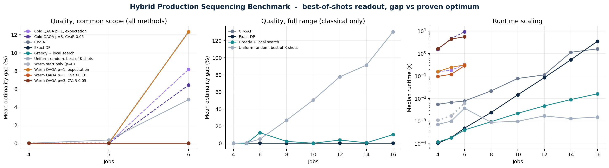
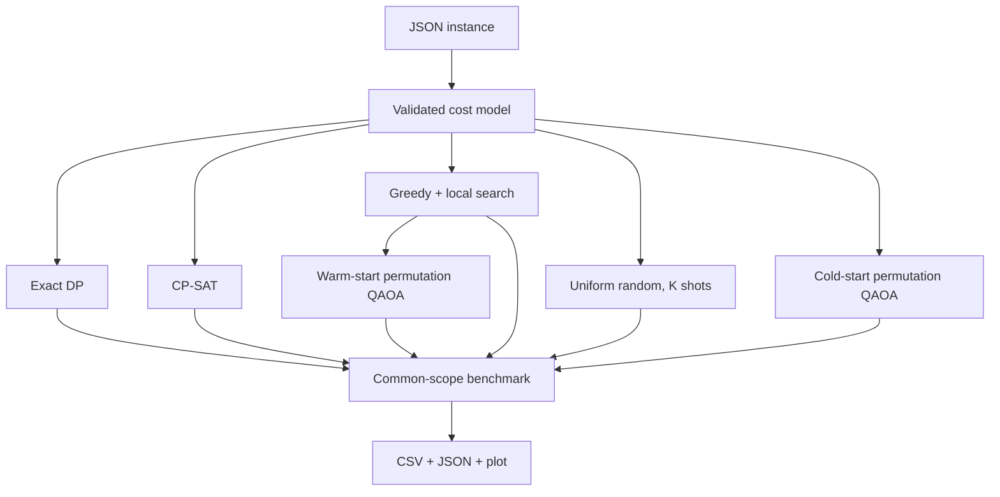

# Hybrid Industrial Scheduling Benchmark

A reproducible benchmark for **production sequencing under due-date, energy-price, and family-changeover costs**. The same validated objective is solved with:

1. an exact subset dynamic program,
2. an OR-Tools CP-SAT baseline,
3. a fast greedy + pair-swap local search,
4. a uniform random sampler under a fixed shot budget, and
5. a constraint-preserving permutation-QAOA statevector simulator, in warm- and cold-start
   variants, under either an expectation or a CVaR merit function.

The project is designed as an honest decision-support benchmark. It does **not** assume or claim
quantum advantage. It is built specifically to make the *absence* of an effect visible: several
arms exist only as controls, and one of them (`p=1`, expectation) is included precisely because it
demonstrably does nothing.



*Left panel, n=6: greedy + local search, the p=0 warm start, and the p=1 expectation QAOA are a
single overlapping line at 12.3% - they return the same schedules. The CVaR arms sit at 0%.*

## Why this problem matters

Production planners often need to order jobs while balancing competing operational costs:

- urgent jobs should not be pushed beyond their due slots;
- energy-intensive jobs should avoid expensive time-of-use slots;
- switching between product families creates setup and cleaning costs.

This repository isolates that sequencing layer in a compact model that is easy to audit, reproduce, and extend. It is a deliberately simplified industrial benchmark rather than a claim of a complete factory scheduler.

## Benchmark snapshot

All numbers below come from 24 deterministic instances (sizes 4-16, seeds 11, 23, 37) and are
regenerated by `hybrid-schedule benchmark`. Statevector QAOA runs only on 4-6 jobs because the
feasible permutation space grows as `n!`.

**Like-for-like comparison** on the 9 instances every method solved (n = 4, 5, 6). This is the
only cross-method table in this README; a method evaluated on n<=6 must never be compared against
one evaluated on n<=16.

| Method | Observed gap | Expected K-shot gap | Optimal | Single-shot success | Median runtime |
|---|---:|---:|---:|---:|---:|
| Exact dynamic programming | 0.00% | - | 9/9 | - | 0.0002 s |
| CP-SAT (proved optimal) | 0.00% | - | 9/9 | - | 0.007 s |
| Greedy + local search | 4.11% | - | 7/9 | - | 0.0002 s |
| Uniform random, best of 128 shots | 1.73% | 4.75% | 4/9 | 0.017 | 0.0010 s |
| Warm start only, p=0 (no circuit) | 4.11% | 4.11% | 7/9 | 0.544 | 0.0017 s |
| Warm QAOA p=1, expectation | 4.11% | 4.10% | 7/9 | 0.553 | 0.232 s |
| **Warm QAOA p=1, CVaR 0.10** | **0.00%** | **0.24%** | **9/9** | 0.369 | 0.121 s |
| **Warm QAOA p=3, CVaR 0.05** | **0.00%** | **<0.01%** | **9/9** | 0.146 | 2.438 s |
| Cold QAOA p=1, expectation | 2.73% | 4.22% | 7/9 | 0.040 | 0.183 s |
| Cold QAOA p=3, CVaR 0.05 | 2.15% | 2.34% | 7/9 | 0.063 | 4.668 s |

Classical arms across the full range (n = 4-16, 24 instances):

| Method | Mean gap | Optimal | Median runtime |
|---|---:|---:|---:|
| Exact dynamic programming | 0.00% | 24/24 | 0.009 s |
| CP-SAT | 0.00% | 24/24 | 0.029 s |
| Greedy + local search | 3.61% | 15/24 | 0.002 s |
| Uniform random, best of 128 shots | 47.78% | 4/24 | 0.001 s |

Exact DP defines the reference. Exact DP and CP-SAT are independently validated against brute
force (`tests/test_solvers.py`, n = 4-6), and they agree on all 24 benchmark instances.

### Three things this table is built to prevent

**1. The p=0 row exists so that "QAOA works" cannot be claimed for free.** A warm start that puts
0.7 of its mass on a good classical schedule already scores 4.11% and 0.544 success probability
with no circuit applied at all. Any p>=1 arm has to beat that row, not the greedy row.

**2. Expectation minimisation is a poor merit function for this warm-start configuration on these
instances, and the p=1 expectation row shows it.** Starting from a concentrated warm start, mixing
moves probability onto worse
permutations and *raises* the expected cost, so the optimiser correctly drives `beta` toward zero
(observed: 0.023, 0.000, 0.138, 0.013). The circuit is optimised into doing nothing. On the 9
common instances that arm returns the warm-start schedule **9 times out of 9** - never better,
never worse. Reproduce it yourself:

```bash
hybrid-schedule compare results/benchmark.csv \
    greedy_local_search warm_start_permutation_qaoa_p1
# -> {"challenger_better": 0, "challenger_worse": 0, "identical": 9}
```

A tail-sensitive CVaR objective removes the incentive to stand still, and the same command against
the CVaR arm reports 2 wins, 0 losses.

**3. Success probability and argmax are informative, but neither is sufficient as a standalone
solution-quality metric.** In these runs, success probability falls (0.553 -> 0.369 -> 0.146)
while the expected best-of-128 result improves because the distributions spread useful mass across
several low-cost schedules. Under a 128-shot
budget, 0.146 still means the optimum is found with probability `1 - (1 - 0.146)^128 > 0.9999`.
For the same reason the benchmark reports a **best-of-K-shots readout** as the solution, with the
old argmax readout kept alongside it in `argmax_*` columns: the CVaR arms score 0.00% on
best-of-shots and 11-40% on argmax. Argmax cannot see the improvement.

The uniform-random row is the control that keeps the shot readout honest: with 128 shots and only
24 feasible permutations at n=4, random sampling solves small instances with high probability,
so a sampler
must beat *that*, not just beat greedy. Its observed 1.73% is one lucky seed; the exact expectation
under uniform sampling is 4.75% mean gap and a 60.5% probability of returning an optimum across
the nine common-scope instances. Expected K-shot metrics are therefore reported alongside every
sampler's observed readout.

Runtime comparisons are implementation- and hardware-dependent. The QAOA arms enumerate all `n!`
permutation costs before the circuit runs, so their reported runtime is optimiser overhead on top
of an already-solved problem and is not a solve time. See [`results/benchmark.csv`](results/benchmark.csv)
for every run.

## Model

For a permutation `pi`, job `pi[t]` is assigned to slot `t`. The objective is

```text
total cost = lateness cost + time-of-use energy cost + family changeover cost
```

More explicitly:

```text
sum_t [w_late * priority(pi[t]) * max(0, t - due_slot(pi[t]))
       + w_energy * energy(pi[t]) * price(t)]
+ sum_t w_change * setup(family(pi[t]), family(pi[t+1]))
```

All methods call the same objective implementation, preventing metric drift between solvers.

## Architecture



## Quick start

Python 3.11 or newer is required.

```bash
python -m venv .venv
source .venv/bin/activate
pip install -e ".[cpsat]"
```

Solve the included instance:

```bash
hybrid-schedule solve examples/sample_instance.json --method exact
hybrid-schedule solve examples/sample_instance.json --method cpsat
hybrid-schedule solve examples/sample_instance.json --method heuristic

# the arm that does nothing, and the arm that does something
hybrid-schedule solve examples/sample_instance.json --method qaoa --depth 1
hybrid-schedule solve examples/sample_instance.json --method qaoa --depth 1 --alpha 0.10 --shots 128

# no classical hint at all
hybrid-schedule solve examples/sample_instance.json --method qaoa --depth 3 --alpha 0.05 --no-warm-start
```

Ask whether a method ever actually changes the answer:

```bash
hybrid-schedule compare results/benchmark.csv greedy_local_search warm_start_permutation_qaoa_p1
```

Generate another deterministic instance:

```bash
hybrid-schedule generate --size 8 --seed 42 --output examples/generated_instance.json
```

Reproduce all results and the figure:

```bash
hybrid-schedule benchmark --output-dir results
hybrid-schedule benchmark --sizes "4 6 8" --seeds "11 23" --shots 512 --no-cpsat
```

Run the tests:

```bash
PYTHONPATH=src python -m unittest discover -s tests -v
```

## Optional API

Install the API extra and start the service:

```bash
pip install -e ".[api]"
uvicorn hybrid_scheduler.api:app --host 0.0.0.0 --port 8000
```

The API exposes `GET /health` and `POST /solve/exact` or `POST /solve/heuristic`. QAOA is intentionally excluded from the synchronous API because statevector cost grows factorially.

## Solver design

### Exact dynamic programming

The exact method stores the cheapest partial schedule for every `(job subset, last job)` state. It has `O(n^2 2^n)` time and `O(n 2^n)` memory complexity and is restricted to 20 jobs.

### Greedy + local search

The heuristic constructs a schedule from slot-aware placement, urgency, and transition costs, then repeatedly evaluates all pair swaps until no improving move remains.

### CP-SAT

An assignment formulation (`x[j][t] = 1` iff job `j` occupies slot `t`) with changeover costs
linearised through one indicator per (family, family, slot) triple. It proves optimality on all 24
instances and agrees with the exact DP everywhere, which is what makes it useful: it is a second
independent implementation of the same objective, so a disagreement would expose a modelling bug in
either solver.

### Permutation QAOA

The quantum benchmark works directly in the feasible permutation basis, so the mixer is the
adjacency matrix of the Cayley graph of `S_n` under adjacent transpositions. That matrix is real
symmetric and the graph is connected (both asserted in the tests), so evolution is unitary and
never leaves the feasible set - no one-hot penalty coefficient is needed.

Three knobs, each of which changes the conclusion:

- `--depth p`, with **`p=0` applying no circuit at all** and reporting the initial distribution.
  This is the baseline any positive result has to clear.
- `--alpha`, the CVaR tail fraction. `alpha=1.0` is the plain expectation and, from a concentrated
  warm start, is minimised by leaving the state alone. Smaller `alpha` rewards putting *any* mass
  on excellent permutations.
- `--shots`, the measurement budget for the best-of-K readout, which is how a sampler is actually
  used. The old argmax readout is still reported in the `argmax_*` columns for comparison.

`--no-warm-start` replaces the 70/30 heuristic-centred initial state with the uniform
superposition, isolating how much of any result came from the classical hint rather than the
circuit.

This is a statevector research benchmark. It is not presented as a hardware-ready implementation or
evidence of quantum speedup. No arm here beats CP-SAT, and the sizes at which the quantum arms run
are sizes at which brute force takes milliseconds.

## Repository structure

```text
src/hybrid_scheduler/   model, solvers, benchmark, CLI, optional API
tests/                  correctness and feasibility tests
examples/               reproducible JSON instance
results/                raw CSV, summary JSON, and generated figure
docs/methodology.md     formulation, algorithms, and limitations
.github/workflows/      tests and linting on Python 3.11/3.12
Dockerfile              reproducible CLI container
```

## Extension roadmap

- multiple machines and machine eligibility;
- **processing times.** The model assigns jobs to unit-length slots, so job durations do not enter
  any cost term. v0.1.0 carried a `processing_time` field that was never read; it has been removed
  rather than left to imply otherwise. Real durations would make `due_slot` a due *date* and let
  energy prices apply over intervals - a genuine modelling upgrade, tracked here rather than faked;
- release times and sequence-dependent setup durations;
- uncertainty scenarios for demand and energy prices;
- commercial MILP baselines;
- alternative constraint-preserving mixers beyond adjacent transpositions;
- shot-budget-matched comparison against simulated annealing and tabu search;
- noise-aware circuit experiments and hardware resource estimates.

## Author

**Milad Ghadimi**  
Optimization, Applied AI & Quantum Computing Engineer 
[LinkedIn](https://www.linkedin.com/in/milad-ghadimi/) | [GitHub](https://github.com/MiladGhadimi) | [Google Scholar](https://scholar.google.com/citations?user=QH53hSAAAAAJ&hl=en)

## License

MIT
